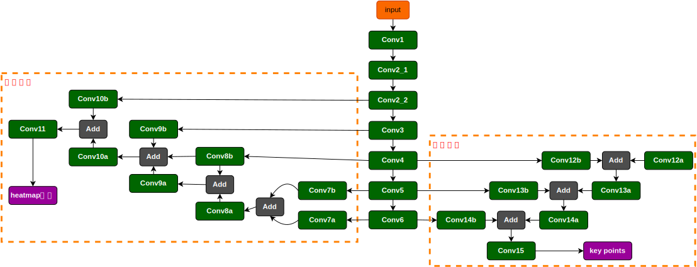
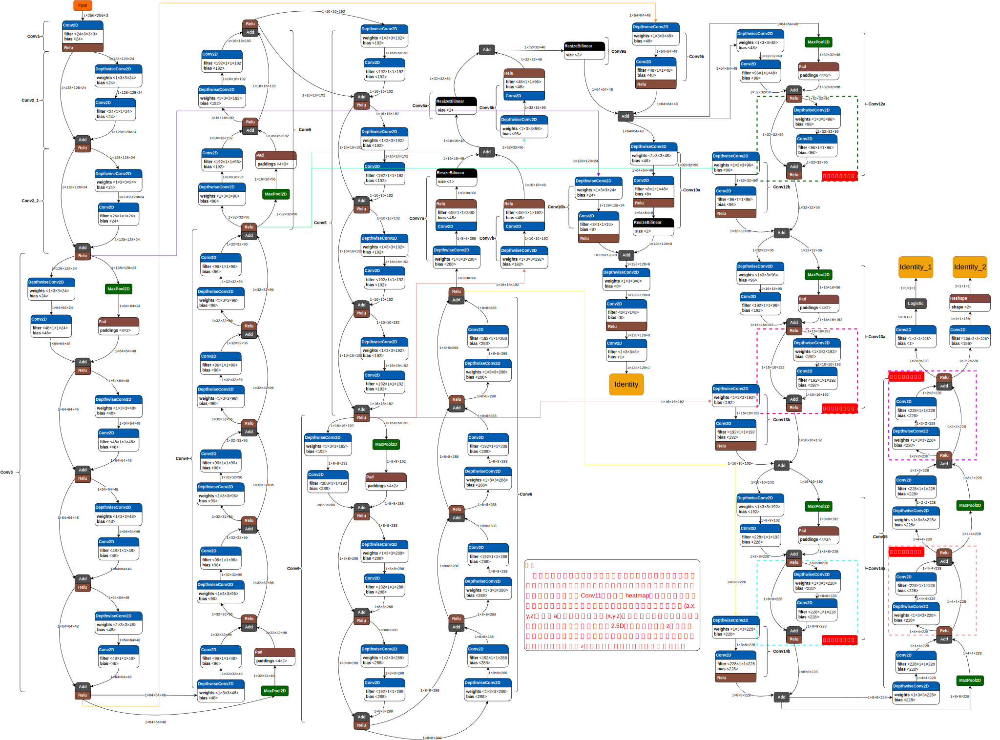
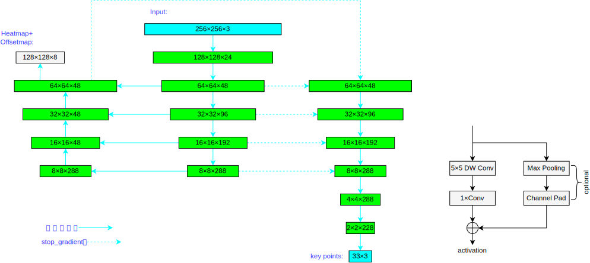

# BlazePose复现代码
BlazePose paper is "BlazePose: On-device Real-time Body Pose tracking" by Valentin Bazarevsky, Ivan Grishchenko, Karthik Raveendran, Tyler Zhu, Fan Zhang, and Matthias Grundmann. Available on [arXiv](https://arxiv.org/abs/2006.10204).

## Requirements
```
tensorflow
cv2
numpy
pathlib
scipy
```

## 环境

```
Linux (Ubuntu 18.04 LTS)
python3.9
RTX 3090ti
```


## 数据集

使用的是[lsp数据集](http://sam.johnson.io/research/lsp.html)

关键点的顺序如下：

```
右脚踝
右膝
右臀部
左髋
左膝
左脚踝
右手腕
右肘
右肩
左肩
左肘
左手腕
脖子
头
```

## 模型

### 简易模型图

描述了层与层的关系，共23层



### 完整模型图

将23层的实现细节和层与层的连接完整展现。



### 网络结构



## 训练

### 训练热图分支

将`config.py`中的`train_mode`设置为`train_mode = 0`，然后运行`python train.py`。

### 微调联合回归分支

将`config.py`中的`train_mode`设置为`train_mode = 1`，并且设置一个合适的`best_pre_train`值，`best_pre_train`是训练损失下降但测试准确的最佳时期数。然后运行`python train.py`。


## 测试
将`config.py`中的`epoch_to_test`设置为想要测试的`epoch`，然后运行`python test.py`。

## 性能比较

### Quality

| Model      | LSP Dataset <br /> `PCK@0.2`  |            
| ------------ | ---------------- |
| 官方模型(Heavy)       | 97.5 |
| 官方模型(Full)        | 95.7  |
| 官方模型(Lite)        | 93.5  |
| AlphaPose ResNet50    | 96.0  |
| Apple Vision          | 88.6	|
| Ours                  | 82.5	|

### FPS

| Model      | FPS <br /> `AMD Ryzen 7 5800H with` <br /> `Radeon Graphics 3.20 GHz`  |            
| ------------ | ---------------- |
| 官方模型(Heavy)  | 38 |
| 官方模型(Full)   | 32  |
| 官方模型(Lite)   | 25  |
| OpenPose        | 6  |
| Ours            | 29	|

## 参考文献

```tex
@article{Bazarevsky2020BlazePoseOR,
  title={BlazePose: On-device Real-time Body Pose tracking},
  author={Valentin Bazarevsky and I. Grishchenko and K. Raveendran and Tyler Lixuan Zhu and Fangfang Zhang and M. Grundmann},
  journal={ArXiv},
  year={2020},
  volume={abs/2006.10204}
}
```
