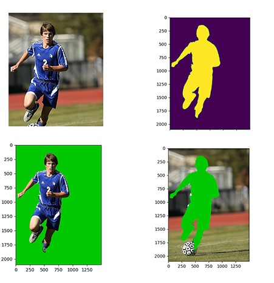
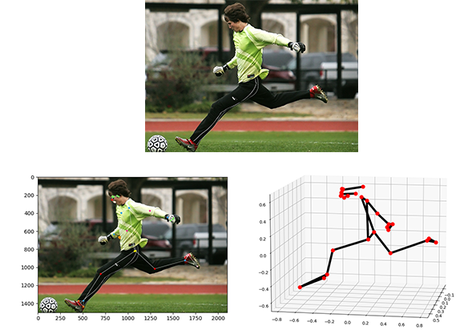
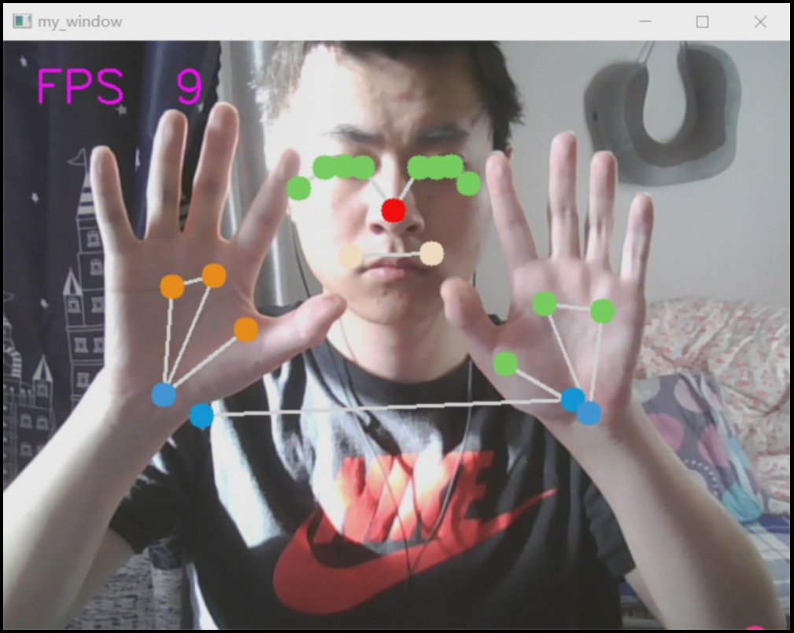
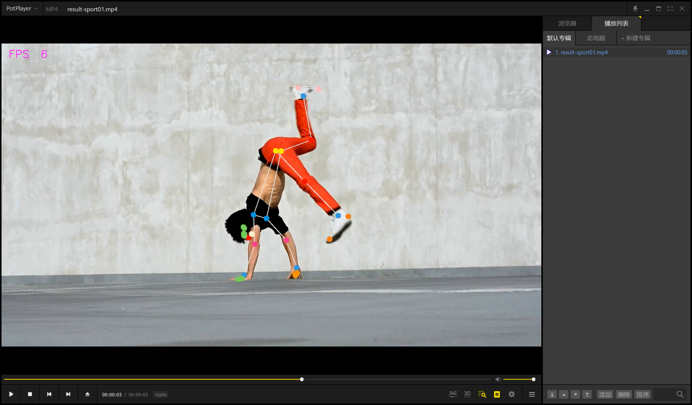

# BlazePose PC端的姿态识别代码

首先值得注意的是，本项目的代码大量使用了mediapipe库，但是将官方模型替换成了我们训练好的模型。

因此需要将训练的`.h5`模型用`tf`工具转换成`.tflite`模型，并重命名为`pose_landmark_full.tflite`，将其复制替换到`Python39/Lib/site-packages/mediapipe/modules/pose_landmark`下。


该部分有4部分代码，包括`./mask&cloud_3d.py`、`./Single image.py`、`./camera.py`、`./video.py`。

## Requirements
```
cv2
mediapipe
numpy
matplotlib
open3d
time
tqdm
socket
serial
math
```

## 环境

```
windows10
python3.9
IntelliJ IDEA 2021.3 (Ultimate Edition)
```

## mask&cloud_3d.py

该部分主要将图像中的人物检测出来并蒙版抠图，主要是为后续的关键点检测提供 ROI。



## Single image.py

本部分完成的是对于单张图片的BlazePose关键点检测。函数主要调用了 MediaPipe 库。



## camera.py

本部分主要是使用BlazePose模型对摄像头实时检测。主要代码和单张图片类似，不过输入换成了摄像头。



## video.py

本部分核心代码和实时检测摄像头相同，主要加了一个生成视频的函数。这样使得输入输出均为视频。




