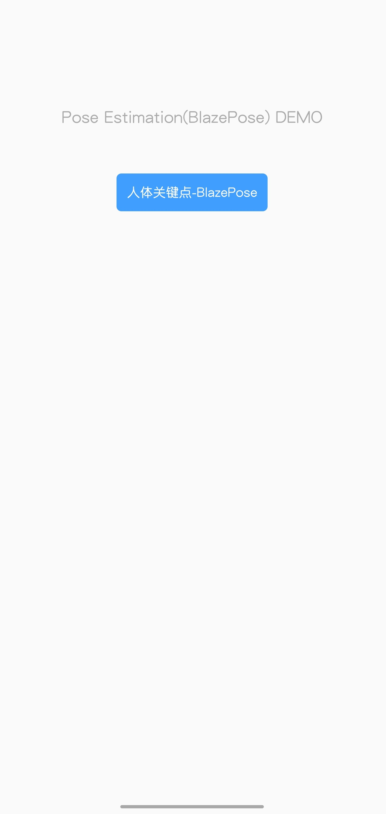
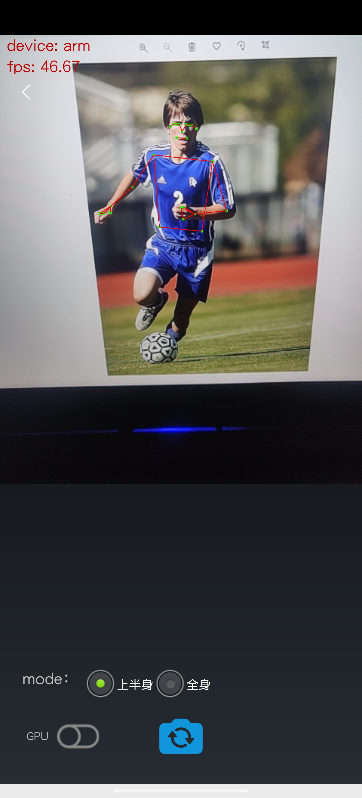
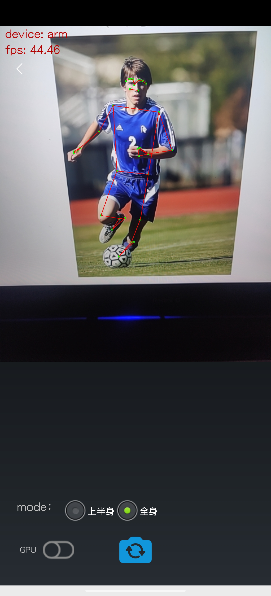
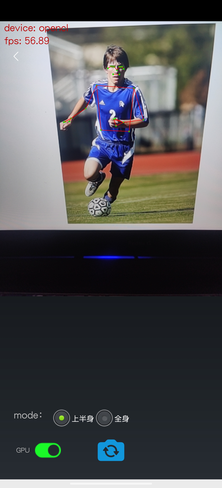
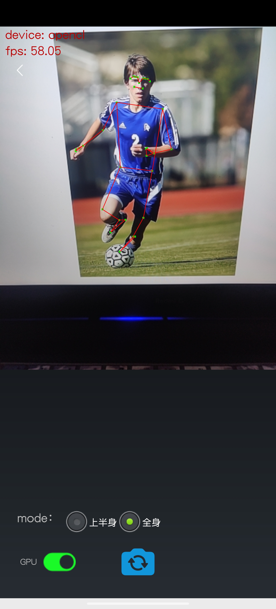

# BlazePose 手机端的姿态识别代码

使用`Android Studio`部署，将`./BlazePose_app/examples/android`作为项目打开。

## 环境

```
windows10
Android Studio Bumblebee | 2021.1.1 Patch 2
```

对于移动端的部署，本项目采用腾讯的 [TNN](https://github.com/Tencent/TNN) 轻量化框架，其提供了各种框架模型 (如 TensorFlow、PyTorch、Caffe等) 转化为TNN模型文件的脚本，还有丰富的 demo 可供学习。其架构图如下。


目前TNN具有的以下特性获得了广泛的好评。

+ 计算优化
    * 针对不同架构在硬件指令发射、吞吐、延迟、缓存带宽、缓存延迟、寄存器数量等特点，深度优化底层算子，极致利用硬件算力。
    * 主流硬件平台 (CPU: ARMv7，ARMv8，X86 GPU: Mali，Adreno，Apple，NV GPU) 深度调优。
    * CNN 核心卷积运算通过 Winograd，Tile-GEMM，Direct Conv 等多种算法实现，保证不同参数、计算尺度下高效计算。
    * Op 融合：离线分析网络计算图，多个小 Op（计算量小、功能较简单）融合运算，减少反复内存读取、kernel 启动等开销。

+ 低精度优化
    * 支持 INT8，FP16 低精度计算，减少模型大小、内存消耗，同时利用硬件低精度计算指令加速计算。
    * 支持 INT8 Winograd 算法，(输入 6bit)，在精度满足要求的情况下，进一步降低模型计算复杂度。
    * 支持单模型多种精度混合计算，加速计算同时保证模型精度。

+ 内存优化
    * 高效“内存池”实现：通过 DAG 网络计算图分析，实现无计算依赖的节点间复用内存，降低 90% 内存资源消耗。
    * 跨模型内存复用：支持外部实时指定用于网络内存，实现“多个模型，单份内存”。

+ 通过 ONNX 支持 TensorFlow，PyTorch，MXNet，Caffe 等多种训练框架，充分利用和融入不断完善的 ONNX 开源生态。当前支持 ONNX 算子 100+，覆盖主流 CNN, NLP 网络。

+ 支持主流安卓、iOS、Embedded Linux 操作系统, Windows, Linux，支持 ARM CPU, x86, Mali GPU, Adreno GPU, NV GPU, 达芬奇 NPU，RK NPU。

+ 模块化设计，将模型解析、计算图构建、优化、底层硬件适配、高性能 kernel 实现各部分抽象隔离，通过 Factory Mode 注册、构建设备，方便接入更多的底层硬件、加速方案。

+ 移动端动态库尺寸仅约 400KB，并提供基础图像变换操作，调用简单便捷。跨平台模型统一、调用接口统一，通过单个配置参数快速切换。

在移动端的部署需要先用 TNN 的官方脚本将本项目训练得出的 h5(*.h5) 模型文件转换成 TNN 模型文件 (tnnmodel)

然后使用 TNN 的 demo 项目将其构建到手机端。

检测结果截图如下。

||
---|---|---
|