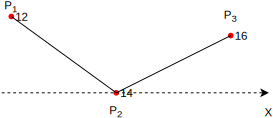

# BlazePose 真实机器人的姿态模仿代码

首先值得注意的是，本项目的代码大量使用了mediapipe库，但是将官方模型替换成了我们训练好的模型。

因此需要将训练的`.h5`模型用`tf`工具转换成`.tflite`模型，并重命名为`pose_landmark_full.tflite`，将其复制替换到`Python39/Lib/site-packages/mediapipe/modules/pose_landmark`下。

该部分有3部分代码，包括`./robot.py`、`./robot.ino`。

## Requirements
```
cv2
mediapipe
numpy
matplotlib
open3d
time
tqdm
socket
serial
math
```

## 环境

```
windows10
python3.9
IntelliJ IDEA 2021.3 (Ultimate Edition)
arduino 1.8.19
```

本部分使用了arduino开发板和一个sg90舵机模拟实时肘部姿态跟踪，可以拓展至16个舵机机器人。由于经费有限，本部分就以一个舵机模型肘部以作性能参考。

## robot.py

由于手上并无wifi模块，所以本部分使用的是USB串联，主要库为serial。计算出右肘部的角度后，通过串口发送给舵机。如图所示，我们只需计算 12-14-16 的夹角即可。


记关键点12为$P_1$，关键点14为$P_2$，关键点16为$P_3$，我们使用`math.atan2`函数，分别计算出线$P_3P_2$和$X$轴的夹角$\angle P_3P_2X$和线$P_1P_2$和$X$轴的夹角$\angle P_1P_2X$，然后再用$\angle P_3P_2X-\angle P_1P_2X$即可得到$\angle P_1P_2P_3$，即右肘部对应的舵机应该旋转的角度。



## robot.ino

读取由指定串口传入的角度数据，来控制舵机的旋转角度。

由于舵机较老，所以演示demo中出现了抖舵现象，切勿在意。

## 结果


